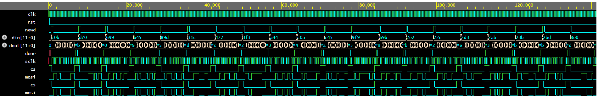

# SPI Master-Slave Verification using SystemVerilog

## Overview

This project implements a **12-bit SPI (Serial Peripheral Interface) Master-Slave communication system** in Verilog and verifies its functionality using a **class-based SystemVerilog verification environment**.

The verification environment includes constrained-random stimulus generation, transaction-level communication using mailboxes, protocol monitoring, scoreboard-based data checking, and SystemVerilog Assertions (SVA) to validate SPI protocol behavior.

The project demonstrates both RTL design and functional verification concepts commonly used in Design Verification.

---

## Project Features

- 12-bit SPI Master implementation
- 12-bit SPI Slave implementation
- Clock divider for SPI serial clock generation
- FSM-based SPI Master design
- Serial data transmission through MOSI
- Active-low Chip Select (CS) control
- Transaction-based verification environment
- Randomized stimulus generation
- Mailbox-based communication
- Driver, Monitor, Generator, and Scoreboard architecture
- Virtual Interface connectivity
- Protocol verification using SystemVerilog Assertions (SVA)
- Functional verification through simulation and waveform analysis

---

## Verification Architecture

The verification environment consists of:

- Generator
  - Generates randomized SPI transactions.

- Driver
  - Drives stimulus to the DUT through the virtual interface.

- Monitor
  - Captures DUT outputs and forwards observed data.

- Scoreboard
  - Compares transmitted and received data to verify correctness.

- Environment
  - Connects all verification components and controls simulation flow.

- Assertions
  - Checks SPI protocol behavior during simulation.

---

## Assertions Implemented

The following SystemVerilog Assertions were implemented:

- Reset initializes SPI signals correctly
- Chip Select (CS) becomes active after a new transaction
- MOSI never contains X or Z values during transmission
- Done is asserted only after complete data transfer
- Done remains low while transfer is in progress
- Done is asserted for a single clock cycle

---

## Simulation Result

- Successfully verified multiple randomized SPI transactions
- Driver and Monitor data matched for every transaction
- Scoreboard reported successful comparisons
- All implemented assertions passed successfully
- Simulation completed without functional errors

---

## Project Structure

```text
SPI_Master_Slave_Verification/
│
├── docs/
│   └── spi_waveform.png              # GTKWave simulation waveform
│
├── rtl/
│   ├── spi_if.sv                     # SPI interface
│   ├── spi_master.sv                 # SPI Master RTL
│   ├── spi_slave.sv                  # SPI Slave RTL
│   └── spi_top.sv                    # Top module
│
├── testbench/
│   ├── transaction.sv                # Transaction class
│   ├── generator.sv                  # Random stimulus generator
│   ├── driver.sv                     # Drives transactions to DUT
│   ├── monitor.sv                    # Captures DUT outputs
│   ├── scoreboard.sv                 # Data comparison
│   ├── environment.sv                # Connects verification components
│   ├── spi_assertions.sv             # SystemVerilog Assertions (SVA)
│   └── spi_tb.sv                     # Top-level testbench
│
└── README.md
```

## Waveform

The waveform demonstrates:

- SPI clock generation (SCLK)
- Active-low Chip Select (CS)
- MOSI serial data transmission
- Successful completion of SPI transfer
- Matching transmitted and received 12-bit data

(Added waveform image below)



---

## Tools Used

- SystemVerilog
- Verilog HDL
- EDA Playground / QuestaSim
- GTKWave

---

## Key Learning Outcomes

- RTL Design
- Finite State Machine (FSM)
- SPI Protocol
- Class-Based Verification
- Randomized Testing
- Mailbox Communication
- Virtual Interface
- Scoreboard-Based Checking
- SystemVerilog Assertions (SVA)
- Debugging using Waveform Analysis
